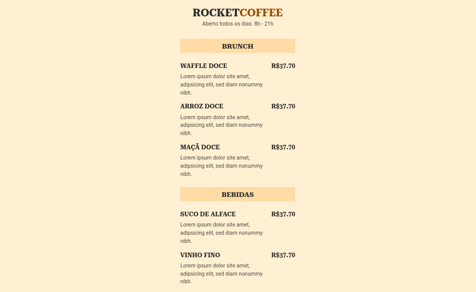

<h1 align="center">RocketCoffee</h1>

O menu digital da "RocketCoffee", uma empresa fictícia, que oferece de maneira acessível e digital o seu cardápio. Projeto desenvolvido durante a Maratona Explorer 3.0.

## 🔎| Visualize
Visualize o resultado atual do projeto:

- [GitHub Pages](https://wesley-nilton.github.io/rocketcoffee/)

## 🛸| Tecnologias
Na construção do projeto foram utilizadas as seguintes tecnologias:

- [HTML](https://developer.mozilla.org/pt-BR/docs/Web/HTML)
- [CSS](https://developer.mozilla.org/pt-BR/docs/Web/CSS)

## 🎯| Bibliotecas
Na construção do projeto foram utilizadas as seguintes bibliotecas:

- [Google Fonts](https://fonts.google.com/)

## 👥| Autor(es)
Autores e contribuidores do projeto:

- [Wesley Nilton](https://github.com/Wesley-Nilton)